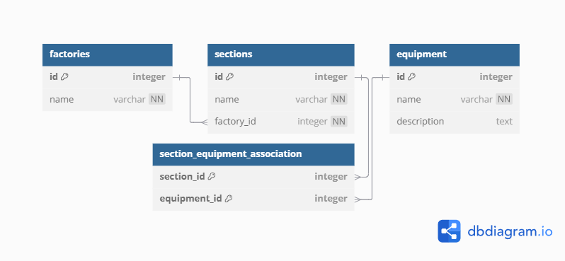

# API Справочников предприятия

API для управления иерархической справочной информацией о фабриках, участках и оборудовании на предприятии.
Приложение разработано на FastAPI с использованием SQLAlchemy для взаимодействия с базой данных и Alembic для управления миграциями схемы БД.

## Описание

Система позволяет:
- Создавать и управлять тремя основными справочниками: фабрики, участки, оборудование.
- Устанавливать иерархические связи:
    - Каждая фабрика может иметь один или несколько участков.
    - Каждый Участок может содержать один или несколько единиц Оборудования.
    - Каждая единица Оборудования может принадлежать одному или нескольким участкам.
- Получать полную иерархическую структуру (родителей и детей) для любой сущности (фабрики, участка, оборудования).

## Технологический стек

- **Backend:** Python, FastAPI
- **ORM:** SQLAlchemy
- **Миграции БД:** Alembic
- **База данных:** SQLite
- **Сервер:** Uvicorn (+ Gunicorn для production)

### Шаги установки

1.  **Клонировать репозиторий:**
    ```bash
    git clone <URL_вашего_репозитория>
        ```
2.  **Создать и активировать виртуальное окружение:**
    ```bash
    python3 -m venv venv
    source venv/bin/activate  # для Linux/macOS
    venv\Scripts\activate    # для Windows
    ```

3.  **Установить зависимости:**
    ```bash
    pip install -r requirements.txt
    ```

5.  **Настройка базы данных:**

    Используется **SQLite**. Файл `spravochniki.db` будет создан автоматически.

    Структура и связи между таблицами：
    

    Применить миграции базы данных:**
    ```bash
    alembic upgrade head
    ```
    При изменении моделей в `app/models.py` необходимо создавать новые миграции:
    ```bash
    alembic revision -m "Описание изменений"
    alembic upgrade head
    ```

### Запуск приложения

1.  **Запустить FastAPI приложение с помощью Uvicorn:**
    ```bash
    uvicorn app.main:app --reload --host 0.0.0.0 --port 8000
    ```
2.  **Доступ к приложению:**
    *   **Веб-интерфейс (UI):** `http://localhost:8000/`
    *   **Документация API (Swagger UI):** `http://localhost:8000/docs`
    *   **Альтернативная документация (ReDoc):** `http://localhost:8000/redoc`
 
## Автор
**[Анастасия Харькова](https://github.com/AVKharkova)**