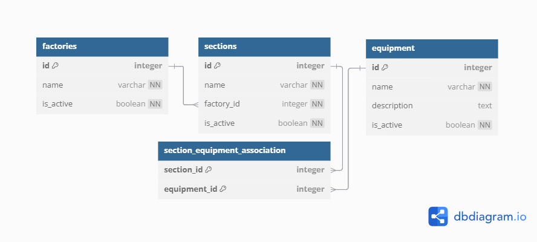

# API cправочников предприятия

API для управления иерархической справочной информацией о фабриках, участках и оборудовании на предприятии.
Приложение разработано на FastAPI с использованием SQLAlchemy для взаимодействия с базой данных и Alembic для управления миграциями схемы БД.

## Описание

Система позволяет:
- Создавать и управлять тремя основными справочниками: фабрики, участки,
  оборудование.
- Устанавливать иерархические связи:
  - Каждая фабрика может иметь один или несколько участков.
  - Каждый участок может содержать один или несколько единиц оборудования.
  - Каждая единица оборудования может принадлежать одному или нескольким
    участкам.
- Получать полную иерархическую структуру (родителей и детей) для любой
  сущности (фабрики, участка, оборудования).

## Технологический стек

- **Backend:** Python, FastAPI
- **ORM:** SQLAlchemy
- **Миграции БД:** Alembic
- **База данных:** SQLite
- **Сервер:** Uvicorn (+ Gunicorn для production)

### Шаги установки

1.  **Клонировать репозиторий:**
    ```bash
    git clone https://github.com/AVKharkova/factory_test.git
    ```

2.  **Создать и активировать виртуальное окружение:**
    ```bash
    python3 -m venv venv
    source venv/bin/activate  # для Linux/macOS
    venv\Scripts\activate    # для Windows
    ```

3.  **Установить зависимости:**
    ```bash
    pip install -r requirements.txt
    ```

5.  **Настройка базы данных:**

    Структура и связи между таблицами：
    

    Используется SQLite. Файл spravochniki.db создаётся автоматически при запуске приложения. Миграции применяются автоматически благодаря lifespan в app/main.py. Для создания новых миграций при изменении моделей в app/models.py выполните:
    ```bash
    alembic revision -m "Описание изменений"
    ```

### Запуск приложения

1.  **Запустить FastAPI приложение с помощью Uvicorn:**
    ```bash
    uvicorn app.main:app --reload --host 0.0.0.0 --port 8000
    ```
2.  **Доступ к приложению:**
    *   **Веб-интерфейс (UI):** `http://localhost:8000/`
    *   **Документация API (Swagger UI):** `http://localhost:8000/docs`
    *   **Альтернативная документация (ReDoc):** `http://localhost:8000/redoc`

### Запуск через Docker

1. **Собрать и запустить контейнер:**
    Убедитесь, что у вас установлен Docker. В корневой директории проекта выполните команды:
    ```bash
    docker build -t factory_test
    docker run -d -p 8000:8000 --name factory_test factory_test
    ```
    Приложение будет доступно по адресу http://localhost:8000. Миграции Alembic
применяются автоматически при старте контейнера.

2. **Остановить контейнер:**
    ```bash
    docker stop factory_test
    ```

3. **Удаление контейнера:**
    ```bash
    docker rm factory_test
    ```

### Сохранение данных SQLite в Docker

Файл `spravochniki.db` создаётся внутри контейнера и теряется при удалении.
Для сохранения данных используйте Docker Volumes.

1. **Создайте Docker Volume:**
   ```bash
   docker volume create factory_test_db_data
   ```

2. **Запустите контейнер с Volume:**
   ```bash
   docker run -d -p 8000:8000 \
     --name factory-test-app \
     -v factory_test_db_data:/app/db_volume \
     factory-test-api
   ```
   Измените `SQLALCHEMY_DATABASE_URL` на
   `sqlite:////app/db_volume/spravochniki.db`.

---
## Автор
**[Анастасия Харькова](https://github.com/AVKharkova)**
